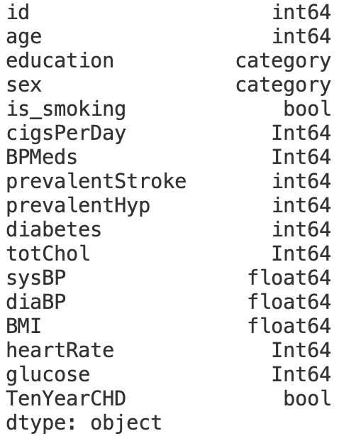

Ссылка на датасет: https://drive.google.com/file/d/1aXF6kBAxg2cA-j0MSgPzUoL4QQiDoJVK/view?usp=sharing - cобирала данные с сайта PubChem через API.

Датасет с платформы Kaggle: https://drive.google.com/file/d/1ZAaB3w-ssykhQXt8ikc9w4RM3seucxpQ/view?usp=sharing.


# Создание переменного окружения (conda + poetry)
Для загрузки miniconda через Homebrew:
```brew install --cask miniconda```

### Создание виртуального окружения и активация c помощью Conda:
* ```conda create -n my_env python=3.13 pip```
* Инициализируем все поддерживаемые оболочки: ```conda init --all``` -> открыть новый терминал
* ```conda activate my_env```

Посмотреть существующие виртуальные окружения:
```conda env list```

### Добавление необходимых библиотек с помощью Poetry:
* Устанавливаем poetry ```pip install poetry```
* Создание пакета my_project в my_project: ```poetry new my_project```
* ```cd my_project``` - переход в директорию
* ```poetry add jupyterlab pandas matplotlib wget``` - добавление новых зависимостей в проект
* ```poetry install --no-root``` - установка всех библиотек из pyproject.toml

Скрипт выгрузки файла из Google Drive и вывод на экран первых 10 строк лежит в ```src/my_project/data_loader.py```

Также в этом файле представлено приведение типов и сохранение в формат .csv

Запуск скрипта:
```python3 src/my_project/data_loader.py```

Ниже представлен скриншот первых 10 строк датафрейма:
.png)

<details>
<summary>Итоговые типы столбцов</summary>

</details>

### black
Установка: ```poetry add --group dev black```

Запуск (форматирование кода):

```poetry run black src/my_project/data_loader.py```