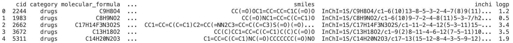

Данные собраны с сайта PubChem через API (https://pubchem.ncbi.nlm.nih.gov/rest/pug/compound/cid/).

Запустить скрипт можно с помощью команды:

```python3 api_example/api_reader.py```

Ниже представлен скриншот первых 5 строк датафрейма:
