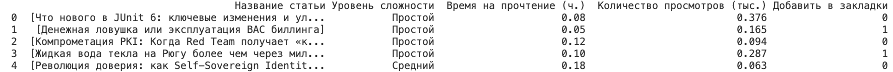

В данной работе парсинг происходит с сайта https://habr.com

Запустить скрипт можно с помощью команды:

```python3 parse_example/data_parser.py```

Ниже представлен скриншот первых 5 строк датафрейма:
